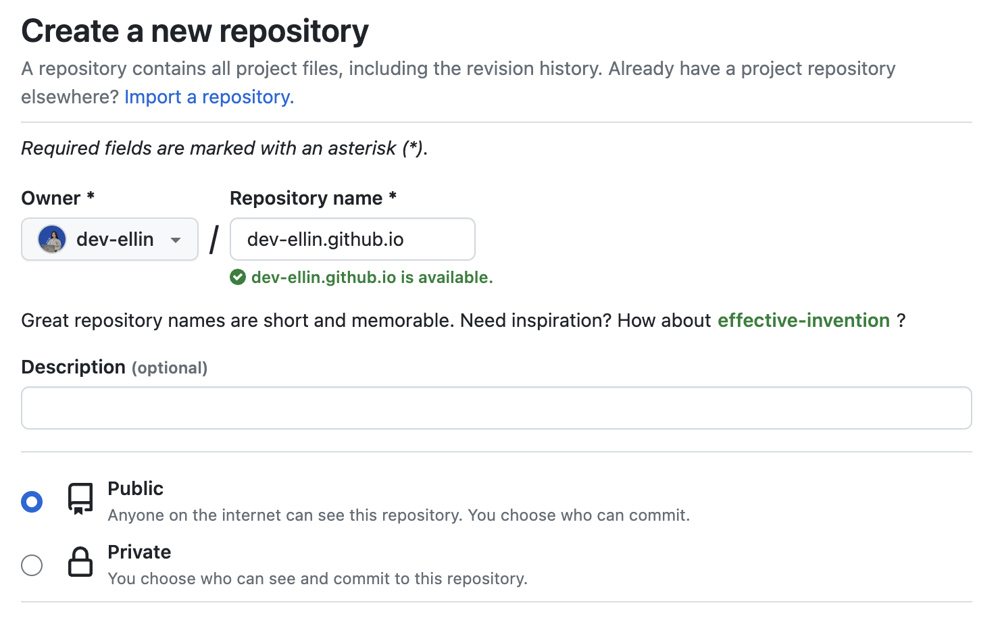

## 준비사항

- 깃허브 계정
  깃허브 블로그를 만들기 위해서는 **깃허브 계정**이 필요합니다.
- Ruby & Jekyll
  - ruby 버전 확인
  
&#36; ruby -v

  - jekyll 설치
  
&#36; gem install jekyll bundler

## Reporisoty 생성

- Repository name을 [usename].github.io 형태로 아래와 같이 작성하세요.

- 생성 완료시 아래와 같이 보입니다.

## Jekyll Theme 준비

- 원하는 테마를 찾아서 zip 파일로 다운 받습니다.
  

- zip 파일 내에 파일과 폴더를 전체 복사해서 원격 repo와 연결된 프로젝트에 붙여넣기 합니다.   겹치는 파일은 모두 새로운 파일로 대체(replace)하시면 됩니다.
  

## 블로그 실행

- 아래 명령어를 순차 입력합니다.

&#36; bundle install  &#36; bundle exec jekyll serve

- 아래와 같이 보이면, http://127.0.0.1:4000에서 테마 적용한 웹페이지를 확인할 수 있습니다.

